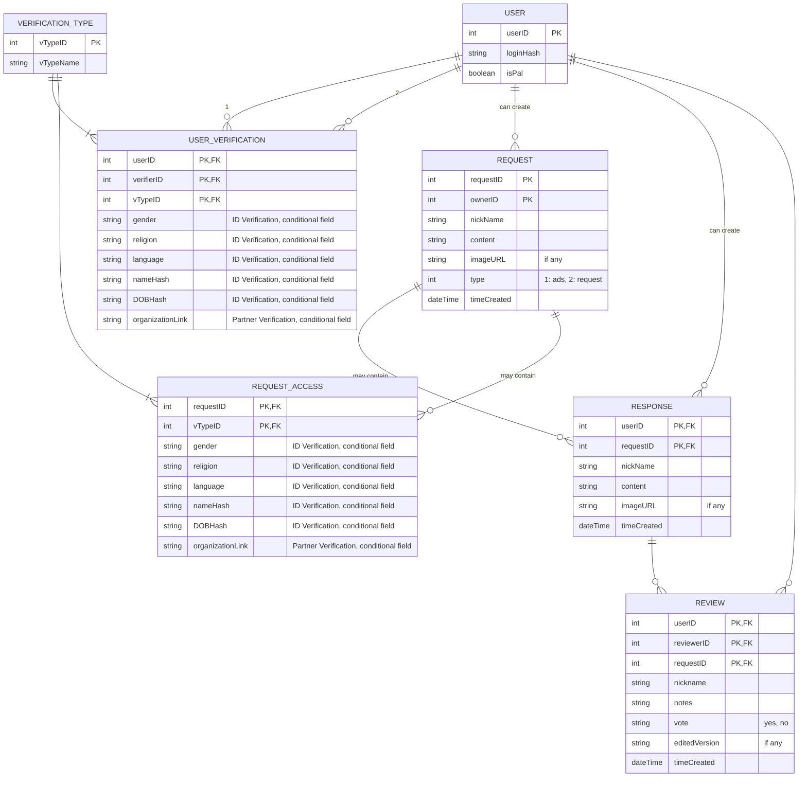

## **Notes:**

### **Verification Types**

1. **Partner Verification:**

   - Organization link

2. **Gaza Verification:**

3. **ID Verification:**

   - Gender
   - Religion
   - Language
   - Name (hashed)
   - DOB (hashed)

4. **Qualification Verification:**

### **Conditional Fields**

This is a relational database, so conditional fields are not best represented here. However, we are using this approach just to visualize the system.

### **Pending Responses**

Only when the response is from **non Gaza Verified** to **Gaza verified** that is currently in Gaza.
It is validated by around 10 ID verified users who can also edit the response.

### **Contributing**

As mentioned above, this is one way to visualize the system. So, please feel free to add to it or to fix any mistake.
