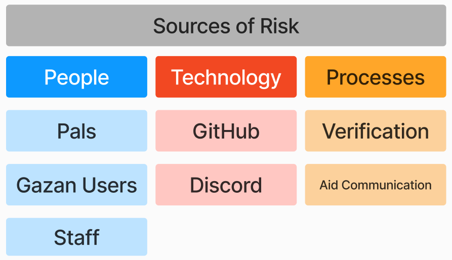

# Risk Identification

## Who is involved in risk identification?
- Front-line staff and volunteers who are dealing with risk in their areas
- Subject Matter Experts interviewed about their focus area
- Ethics and Safety staff
- Strategy, Auditing, and Decision Making staff 

## What are sources of risk?

## How do I report a risk?
If you identify a risk, please go to our [GitHub and add it to the Triage column of the Risk Identification project.](https://github.com/orgs/PalCollective/projects/4)
If you feel that the risk is urgent, please also immediately elevate to any leaders in your area and the Ethics and Safety staff. 

## What is the process after I report a risk? 
Risks in the Triage column will be sorted and prioritized. From there, they will be picked up by a staff member to evaluate, identify measures and metrics to assess the risk, and develop management and mitigation plans. They will work with other staff and experts as needed. The plan will then be approved by multiple people.  

Risks of urgent priority and threatening to safety may require urgent meetings with strategy and decision making people. We may choose that a risk is unacceptable, and project plans must be changed. This will be communicated as soon as possible to those working on that part of the project.

This process will be iterative. We expect to revisit the assessments and management for each risk multiple times as we grow, adapt, and learn.  

