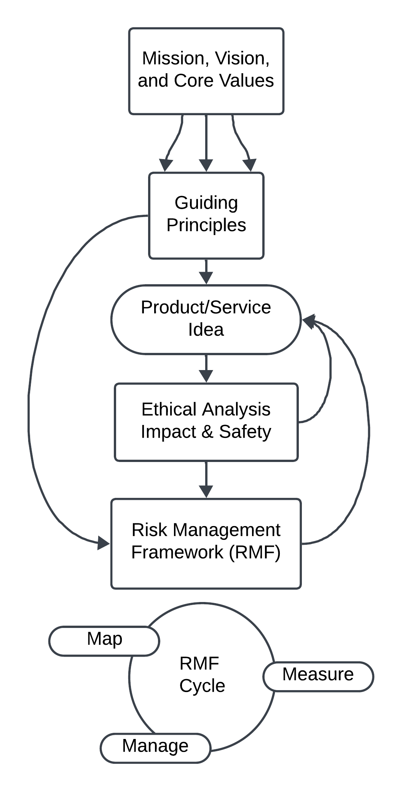

.Spacer
++++
// Spacer
++++

# Introduction - Ethics and Safety

## The role of the ethics and safety team is to prioritize the well-being and safety of Palestinians and Pals, while also ensuring that our actions are in alignment with the core values and principles of PalCollective.    

.Spacer

### We are committed to:   
**Continuous Improvement:** As our collective grows, we continuously refine and update our processes and approaches to better safeguard the interests of the app and its users.  

**Collaboration and Integration:** We collaborate with all focus areas within the organization. We work closely with other teams to integrate risk management practices into every phase of our app's lifecycle.  

**Proactive Risk Management:** We take a proactive approach to risk management. We actively identify, assess, manage, and mitigate risks. We anticipate and address potential issues before they escalate.  

**User-Centric Focus:** We center safeguarding the interests of Palestinian users and our Pals. We prioritize user well-being and safety in all its actions and decisions.  

**Transparency and Accountability:** We are commited to transparency and accountability. 

**https://github.com/PalCollective/documentation/blob/main/FOUNDATIONS.md[Read about our Mission, Vision, Core Values, and Guiding Principles here.]**   

[Spacer]

## Risk and Incident Reporting
Everyone on staff is authorized and encouraged to report.  

https://github.com/PalCollective/documentation/blob/main/ES_Risk_Identification.md[Risk Indentification for Staff]

https://github.com/PalCollective/documentation/blob/main/ES_Risk_Incident_Pals.md[Risk Identification and Incident Reporting for Pals]  

https://github.com/orgs/PalCollective/projects/4[Risk Identification Reporting]  

.Spacer

## Process Overview

.Spacer

## Process Partners
Individual contributors: any and every staff member is an important partner for identifying and managing risk.  We also collaborate closely with team leads to ensure that ethical principles are respected and risks are managed throughout the lifecycle of our app. 

[cols="3,3,4",options="header"]
|===
|Dept |Person |Discord Handle
| Tech | Orwa | orwa84
| People | Janine | janine
| Ethics and Safety | Katie | katiegrillaert
|===

.Spacer

## Resolving Ethical Conflicts
At any time, you can request that someone from Ethics and Safety joins your team to discuss an ethical conflict.

https://github.com/PalCollective/documentation/blob/main/ES_Ethical_Matrix.md[Ethical Matrix] The *ethical matrix* is a participatory tool that can frame ethical conflicts for deliberation by a dedicated team. You can use the template, or request training or participation from someone on Ethics and Safety.  

