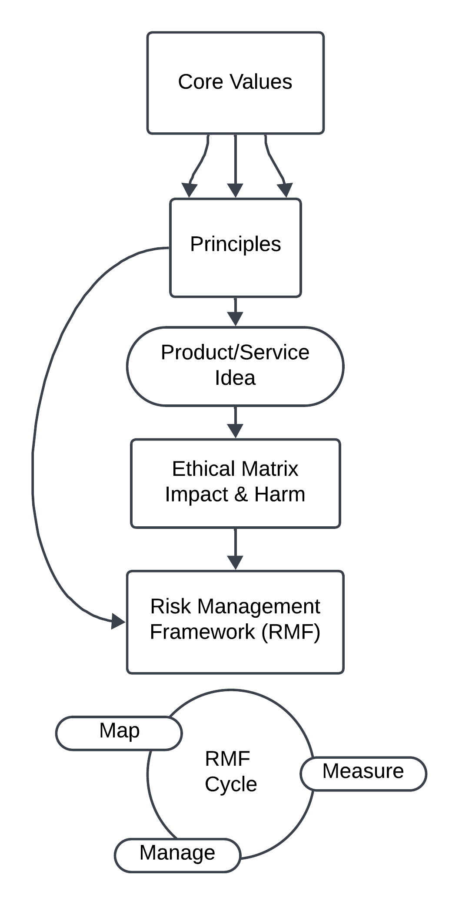

# Introduction - Ethics and Safety

## The role of the ethics and safety team is to prioritize the well-being and safety of Palestinians and Pals, while also ensuring that our actions are in alignment with the core values and principles of PalCollective.    

### We are committed to:   
**Continuous Improvement:** As our collective grows, we continuously refine and update our processes and approaches to better safeguard the interests of the app and its users.  

**Collaboration and Integration:** We collaborate with all focus areas within the organization. We work closely with other teams to integrate risk management practices into every phase of our app's lifecycle.  

**Proactive Risk Management:** We take a proactive approach to risk management. We actively identify, assess, manage, and mitigate risks. We anticipate and address potential issues before they escalate.  

**User-Centric Focus:** We center safeguarding the interests of Palestinian users and our Pals. We prioritize user well-being and safety in all its actions and decisions.  

**Transparency and Accountability:** We are commited to transparency and accountability. 

## Reporting
Report a risk: Risks can and should be reported by any staff member here: [Risk Identification Reporting](https://github.com/orgs/PalCollective/projects/4)   

Report an incident:   

__This document is under construction. Expect it to get a little shinier each time you check back!__

# Table of Contents
link:#how-to-use-this-document[[.underline]#How to Use This Document#]

link:#process-overview[[.underline]#Process Overview#]

____

link:#ethical-matrix[[.underline]#Ethical Matrix#]

____
link:#high-level-matrix[[.underline]#High Level Matrix#]

link:#input-log[[.underline]#Input Log:#]

link:#prioritized-harms[[.underline]#Prioritized Harms#]

link:#next-steps-2[[.underline]#Next Steps:#]

link:#diverse-voices-are-needed-to-help-reach-a-consensus-of-prioritized-values-and-add-any-important-stakeholders.[[.underline]#1.
Diverse voices are needed to help reach a consensus of prioritized
values and add any important stakeholders.#]

link:#palestinian-input-on-potential-harms-is-absolutely-required.[[.underline]#2.
Palestinian input on potential harms is absolutely required.#]

link:#potential-smes-to-query-psychologist-data-governance-expert-cybersecurity-expert-mutual-aid-researcher[[.underline]#3.
Potential SMEs to query: psychologist&#44; data governance expert&#44;
cybersecurity expert&#44; mutual aid researcher#]

link:#prioritize-harms-to-be-moved-into-the-rmf-many-voices-needed[[.underline]#4.
Prioritize harms to be moved into the RMF (many voices needed)#]
____

link:#risk-management-framework[[.underline]#Risk Management Framework#]

____
link:#summary-of-risk-management-framework-rmf[[.underline]#Summary of
Risk Management Framework (RMF):#]

link:#risk-assessment-and-mitigation-framework[[.underline]#Risk
Assessment and Mitigation Framework#]

link:#template-risk-assessment-and-mitigation-framework[[.underline]#TEMPLATE
Risk Assessment and Mitigation Framework#]

link:#next-steps-3[[.underline]#Next Steps:#]

link:#build-out-rmf-katie-working-on-this-others-welcome[[.underline]#1.
Build out RMF (Katie working on this&#44; others welcome)#]

link:#assessment-for-each-prioritized-harm-katie-working-on-this-others-needed[[.underline]#2.
Assessment for each prioritized harm (Katie working on this&#44; others
needed)#]
____

== How to Use This Document

Process: Please see the Process Overview for a high-level view of the
process.

Next Steps: Each section includes a Next Steps section. If you know what
person or team is responsible for that step, please write their name in
that line. If a step has been completed, please either copy/paste or
link to the relevant information.

Your voice: Please add comments or directly edit as needed.

Urgent need: Please add your thoughts to the ethical matrix.

== Process Overview

== Core Values and Principles

Core values: foundation upon which the collective is built. These will
guide the principles, the rules and truths that will provide the
guardrails for the app. Principles provide a framework for ethical
conduct and decision-making.

=== Pyramid of Values

This has been adopted from the GitLab handbook
(https://handbook.gitlab.com/handbook/values/[[.underline]#https://handbook.gitlab.com/handbook/values/#]).

image:media/image5.png[media/image5,width=948,height=387]

=== Safety and Efficiency/Effectiveness: Knobs/Levers

There is a tension between safety and efficiency/effectiveness. We seek
to find the right balance for our application.

image:media/image1.png[media/image1,width=479,height=723]

=== Next Steps:

==== Define core values

==== Define principles 

== Ethical Matrix

If you are having trouble viewing the entire table, please go to Format
→ Switch to pageless view

=== High Level Matrix

[width="100%",cols="20%,20%,20%,20%,20%",options="header",]
|===
| |*Values* | | |
|*Stakeholder* |*Well-being* |*Safety & Privacy* |*Autonomy* |*Justice*

|Palestinian app users a|
* Aid is delayed
* Effort to procure aid not in alignment with amount received
* Method of receiving aid is risky
* Abuse from malicious users (in chat for example)
* Exposing those seeking help to racism, religious proselytizing,
classism, and more from folks who are “well-intentioned”
* Violations of privacy, of intentionally or unintentionally exposing
details of private conversations that would put Gazans at psychological,
physical or emotional risk
* Exploitation (of personal shared stories) and/or abuse within the chat
* Invitation system is inaccessible OR allows in bad actors

a|
* Identity is exposed to mafia, Israeli actors, or other bad actors
* Aid is intercepted and/or misdirected
* Receiving bank account is hacked

a|
* Personhood not respected throughout the process (infantilized,
unnecessary bureaucracy, etc)

a|
* Aid is not distributed in a just/equitable way (based on gender, age,
etc)

|Mutual aid providing app users a|
* Negative mental health effects due to the proximity to war (besides
personal harm, could reduce ability to aid, stop people from interacting
with app, stop recommending it to their friends)
* Volunteers are asked to provide services out of scope, too much money
* Volunteers don’t have training to handle requests (especially wrt
medical/emergency/abuse needs )

a|
* Identity is exposed to unfriendly governments or other bad actors
* Payment details are hacked

| |

|App Development Team a|
* Negative mental health effects due to the proximity to war (besides
personal harm, can slow development/deployment)

a|
* Identity is exposed to unfriendly governments or other bad actors

| |

|Governments* | | a|
* We acknowledge that the very nature of trying to break barriers in
providing aid, may be counter to the goals of the current US government,
and there may be attempts to try to stop this project from law
enforcement, etc. (there is precedence for this)

|
|===

The *ethical matrix* helps to identify potential harms. The matrix
identifies *stakeholders* that interact with or are affected by the app,
and *ethical values* that may be infringed upon due to their use of, or
the existence of, the app. Each cell is filled with *potential harms* to
the stakeholder based on the values that we have prioritized.
Stakeholders and values may be added as more voices are involved in the
discussion and as the app continues to develop. It is acceptable for
some cells to be left blank.

*Potential harms* listed are those that would occur because of
interaction with the app, not including those that are happening at
baseline. For example, Palestinians are of course already experiencing
many negative mental and physical effects due to being victims of war.
It is not listed here because that is not a potential harm of engaging
with the app.

Potential harms will be of *differing priority*. Some may need many
resources and frequent re-assessment, others may be completely
deprioritized at certain points of the lifecycle. For example, “Aid is
not distributed in a just/equitable way (based on gender, age, etc)” may
not be an urgent priority. However, looking further ahead, this may be
more important as fair access to aid could influence the social makeup
as the Palestinian society begins to rebuild.

This is a *starting point for further engagement*. For example, verbal
abuse in the chat may be identified as a realistic harm, and a chatbot
explored to mitigate this harm. This intervention could be further
assessed with an AI-focused assessment (does the chatbot perform equally
well for different languages, does it show bias when filtering comments,
and so on).

This matrix also helps *identify the need for subject matter experts*,
such as those involved in payment security.

*A note about governments (official or unofficial) as a stakeholder. Our
app is not made for them, and we arguably don’t prioritize their needs.
However, the government will prioritize their own need, so this exercise
can help us think about some ways in which the government might feel
infringed upon and move to block the app.

==== Input Log:

[.mark]#Please log the names/roles/expertise of anyone who has
contributed to the ethical matrix. Notes: civilian is an expertise.
Reading and deep thought counts as contributing. Log only the
information the person feels comfortable sharing.#

[arabic]
. Katie, tech steward and ethicist
. tyle: graphics, front-end team, research

=== Prioritized Harms

*Priority Levels*

*P0 (Critical)*: Issues categorized as P0 are critical and require
immediate attention. They pose significant risks to the app's
functionality, security, or user experience, potentially leading to
severe consequences if not addressed promptly. These issues demand
immediate mitigation efforts and may require dedicated resources to
resolve.

*P1 (High)*: Issues categorized as P1 are high priority and should be
addressed urgently. While they may not be as severe as P0 issues, they
still have the potential to cause significant harm or disruption to the
app or its users. Prompt action is necessary to mitigate these risks and
prevent any negative impacts on the app's performance or security.

*P2 (Medium)*: Issues categorized as P2 have a moderate level of
priority. They may not require immediate attention but should be
addressed in a timely manner to prevent them from escalating into more
severe problems. These issues may have a moderate impact on the app or
its users if left unresolved and should be prioritized accordingly.

*P3 (Low)*: Issues categorized as P3 have a low priority and may not
require immediate action. While they should still be addressed, they
have minimal impact on the app's functionality, security, or user
experience. These issues can be handled during regular maintenance
cycles or as resources permit, without causing significant disruptions
to the app's operations.

[width="100%",cols="36%,33%,18%,13%",options="header",]
|===
|*Issue* |*Description of Harm* |*Team* |*Priority Level*
|Inviting Palestinians to app |Need app to be accessible to many but
need to screen out bad actors, need to keep data secure and private a|
Security

Back End

Front End

|P0

| | | |

| | | |
|===

=== Next Steps:

Any and all can contribute to filling out the matrix above.

==== Diverse voices are needed to help reach a consensus of prioritized values and add any important stakeholders. 

==== Palestinian input on potential harms is absolutely required. 

==== Potential SMEs to query: psychologist, data governance expert, cybersecurity expert, mutual aid researcher

==== Prioritize harms to be moved into the RMF (many voices needed)

== Risk Management Framework 

Working on building this out.

image:media/image4.png[media/image4,width=584,height=481]

=== Summary of Risk Management Framework (RMF):

* *Risk identification*: This involves identifying potential risks that
could impact the objectives, including internal and external factors.
This is based off of the ethical matrix, but will go into greater
detail.
* *Risk assessment*: Risks are evaluated in terms of their likelihood of
occurrence and potential impact on the objectives. This assessment helps
prioritize risks based on their significance.
* *Risk response*: After assessing risks, develop strategies to respond
to them. Responses may include avoiding, mitigating, transferring, or
accepting risks, depending on the risk tolerance.
* *Risk monitoring and control*: Once risks have been identified,
assessed, and responded to, ongoing monitoring and control processes are
implemented to track changes in risk exposure and ensure that risk
responses remain effective.
* *Governance and accountability*: Governance structures and processes
to ensure accountability for managing risks effectively throughout the
collective
* *Documentation and reporting*: Clear documentation of the risk
management process and outcomes, as well as regular reporting, are
important to ensure transparency and accountability

image:media/image3.png[media/image3,width=488,height=426]

=== Risk Assessment and Mitigation Framework

==== TEMPLATE Risk Assessment and Mitigation Framework

* Please copy and paste this template as needed for each issue/risk.

*Risk Assessment and Mitigation*

[width="100%",cols="82%,18%",options="header",]
|===
a|
____
*Issue:* What is the issue that is presenting a risk/harm?
____

|P0 Critical
a|
____
*Description:* Description of the potential risks and harms of the
functional issue.

This may be a few lines or a few paragraphs.

Lorem ipsum dolor sit amet, consectetur adipiscing elit, sed do eiusmod
tempor incididunt ut labore et dolore magna aliqua. Quisque non tellus
orci ac auctor. Ullamcorper eget nulla facilisi etiam dignissim diam
quis enim. Commodo odio aenean sed adipiscing diam. Pretium nibh ipsum
consequat nisl vel pretium. Diam sollicitudin tempor id eu nisl nunc mi
ipsum faucibus. Fermentum odio eu feugiat pretium. Mauris augue neque
gravida in fermentum et sollicitudin. At urna condimentum mattis
pellentesque id. Vitae aliquet nec ullamcorper sit amet. Netus et
malesuada fames ac turpis egestas integer. Pretium vulputate sapien nec
sagittis aliquam. Lorem sed risus ultricies tristique nulla aliquet
enim. Ac auctor augue mauris augue neque gravida in fermentum et.
Imperdiet proin fermentum leo vel orci porta non pulvinar. Vel pharetra
vel turpis nunc eget lorem dolor sed viverra. Commodo odio aenean sed
adipiscing diam donec adipiscing tristique risus. Tincidunt praesent
semper feugiat nibh sed pulvinar. Accumsan in nisl nisi scelerisque eu
ultrices vitae. Felis bibendum ut tristique et egestas quis.

Magna sit amet purus gravida quis blandit turpis cursus in. Orci
sagittis eu volutpat odio facilisis mauris sit amet massa. Lacus viverra
vitae congue eu consequat ac felis. Nisi est sit amet facilisis. Risus
feugiat in ante metus. Porta lorem mollis aliquam ut porttitor leo a
diam sollicitudin. Consequat nisl vel pretium lectus quam id leo in
vitae. Feugiat pretium nibh ipsum consequat nisl vel. At tempor commodo
ullamcorper a lacus. Vulputate mi sit amet mauris commodo quis imperdiet
massa tincidunt. Viverra adipiscing at in tellus integer feugiat
scelerisque varius. Odio morbi quis commodo odio aenean sed adipiscing
diam donec. Pharetra diam sit amet nisl.
____

|
|===

*Metrics and Measurements*

Measurements - What relevant raw data can we collect?

[width="100%",cols="26%,26%,24%,24%",options="header",]
|===
|Measurement |Description |Data Collection Methodology |Collection Team
| | | |
|===

Metrics - what quantifiable measures help us assess our performance?

[width="100%",cols="20%,20%,20%,20%,20%",options="header",]
|===
|Metric |Description |Measures Needed |Acceptable Threshold |Assessment
Team
| | | | |
|===

*Mitigation*

____
Mitigation Threshold:
____

* Personnel Responsible for Mitigation:
* Immediate Actions:
** Description:
* Long-Term Strategies:
** Description:

Incident Reporting

* Incident Report Format:
** Date:
** Description:
** Impact:
** Actions Taken:
* Incident Response Team:
** Contact Information:

Additional Considerations

* Legal and Compliance Aspects:
* User Education and Awareness:
* Continuous Monitoring and Updates:

==== 

=== Next Steps:

==== Build out RMF (Katie working on this, others welcome)

==== Assessment for each prioritized harm (Katie working on this, others needed)
