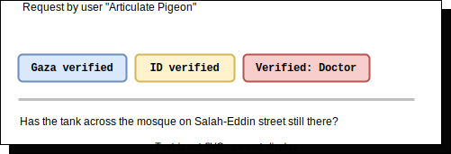

# Introduction

In this document, I try to reflect on what I believe to be the requirements of the **PalCollective solidarity system** (which I would like to call from this point on, _the system_).

This document reflects the evolution of the idea in my mind, as I continue to speak to people inside and outside of Gaza.

So I must warn you that what is in this document may not be in agreement with some of what has been discussed in meetings up to this point.

## Definitions

The _requirements_ for the system, are descriptions of what the system is hoped to be able to do, not how it is implemented. This is what I hope to describe in this document.

The requirements, on the other hand, are derived and backed up by _stories_, which are statements told by potential users about things they would like to experience or avoid while using the system.

The purpose of the system is offering _mutual aid_, which is intuitively understood as offering and receiving solidarity, not only between those who are directly affected and those indirectly affected by the war in Gaza, but also _amongst_ either one of these two groups (e.g. solidarity between people outside of Gaza, as well as solidarity amongst Gazans). 

## Stories

- As someone in Gaza, I want to know that using the app will not lead to me being targeted.
- As someone in Gaza, I want to know that the person I am in contact with is not a malicious actor.
- As someone in Gaza, I would like to get financial help, either to escape Gaza, rebuild my home, or meet by basic needs.
- As someone in Gaza, I feel ashamed of having to ask for money, it is not something that Gazans are used to.
- As someone in Gaza, I would like those who acquire and control aid to give us a fair share of this aid.
- As someone in Gaza, I would like to have more access to aid.
- As someone in Gaza, I would like to find someone who is missing in Gaza.
- As someone in Gaza, I want to receive information in Arabic and in line with my culture and values.
- As someone who wants to offer solidarity, I want to know when the person I am in contact with is actually in Gaza.
- As someone who wants to offer solidarity, I want to know that others offering solidarity are not malicious actors.
- As someone who wants to offer solidarity, I would like to be able to send money to be spent in a way that I decide (e.g. a Qurban or a ritual sacrifice in the North of Gaza, specifically).
- As someone who wants to offer solidarity, I would like to find Gazans who can offer others in Gaza services and resources that I pay for, since the entry of aid is restricted.
- As someone who wants to offer solidarity, I do not want to be repeatedly asked for money when that is not the kind of solidarity I am prepared to give.
- As someone who wants to offer solidarity, I do not want to end up offending, or upsetting the people I am trying to support.

## Users

### Identity

The system does not know the real or digital identity of those using it. It maintains an independent identity that cannot be used to the deduct the email, phone number, and/or the messaging/social-media platform profiles of its users.

This is mainly to protect the users from legal repercussions of their solidarity, considering the hostility of many governments towards the Palestinian cause.

### Verification

Despite the anonymity of users, they can and should "opt in" for a number of verifications, which might incur a one-time fee, but is likely to unlock capabilities within the system.

Note that in case we decide to charge a verification fee, the Gazans, or those directly affected by the war must be exempt, naturally, of having to pay this fee themselves (which can be financed in other ways).

A user who has not gone through any verification is displayed as `unverified`, and their access to the system might be limited to situations when not enough verified members are available.

It is also proposed thought that these verifications are not mutually exclusive. For example, a user can be `Gaza verified`, `ID verified` and `Qualification verified`:

Below is a description of what these verifications mean:
- `ID verified`: the person is able to prove that they are a real person with a legal name, a legal age and a legal country of residence/citizenship.
- `Qualification verified`: the person is able to prove that they are qualified for a specific role in society, such as a journalist, a lawyer, a doctor, a gymnast, a circus performer, etc.
- `Gaza verified`: the person is able to prove that they are currently in Gaza, which is an active war zone.

Note that as people get verified, an anonymized proof of their verification is stored the system, which cannot be used to deduct the personal information that this verification entails.

## Nature of the System

To meet the requirements above, the system has to involve elements of:
- An anonymous request board or an anonymous matching platform[^1]
- A letter proofing/content review/approval management platform

[^1]: I refrain from using the term "market place" because, even though it involves matching, it works towards a different goal than the one of the system we are building.

### Request Board

Users can make timely requests, which can be answered by responses from other users.

Note that users can only respond to a request once.

Requests may, or may not, be limited to users with a certain kind of verification, for example: 

This request is meant for users who are `Gaza verified`.

Below is an another example:

In this example, the request is meant for users who are either `unverified`, or `ID verified`.

Below is a realistic example of two, related requests:

The first request above is meant for users who are  `Gaza verified` (and preferably, who are in the North of the Gaza), for the purpose of identifying an owner of a resource (cattle).
The second request, on the other hand, is meant for users who are  `Gaza verified` (again, in the North of Gaza) who are hungry and in need of that charity.

### Content Review/Approval Management

The above would be sufficient, if it was not for the disparity between the "needs met" between two categories of our users, namely, those whose life is in danger and who are living under catastrophic conditions, and those who are trying to share their solidarity with them while living at a modern standard.

In taking that disparity into consideration, it is evident that those sharing solidarity with their brothers and sisters inside of Gaza bear the additional responsibility of:
- Being aware of the trauma that the Gazans are experiencing on a daily basis
- Being qualified to deal with this trauma
- Being able to accommodate the belief system that allows Gazans to endure this trauma

... and other considerations, which amplify any misalignment in language and/or in value, leading to a measurable deterioration in the quality of solidarity shared.

Hence it is important to think about the different skills, and the layers of communication required to enhance the reception of any solidarity from the outside, which can be achieved via an approver system in which:
1. Responses from users not `Gaza verified` might have to go through auditing by other, non-`Gaza-verified` users
2. These content revisions will address issues such as language, values, and domain-specific knowledge related to the request
3. Upon approval by a certain threshold, affective moderation is achieved and the response is delivered to the `Gaza verified` user's request

### Outcome

The outcome of matching might include the parties matched revealing their identities to one another in a manner consensual and beneficial to both.

As long as this reveal is kept confidential and is strictly not recorded by the platform, then it might be possible to create a relatively safe system

It must also be possible for either party to give feedback on the quality of the responses, the requests, and raise suspicion resulting from actions following the reveal of identities to another user from the platform.

In order to offer maximum safety, it would be wonderful if we can, despite not storing ID verification results, would be able to recognize when the person ID verifying has already been banned from using the platform, for one reason or another, but this might require certain capabilities from the verification partners.
