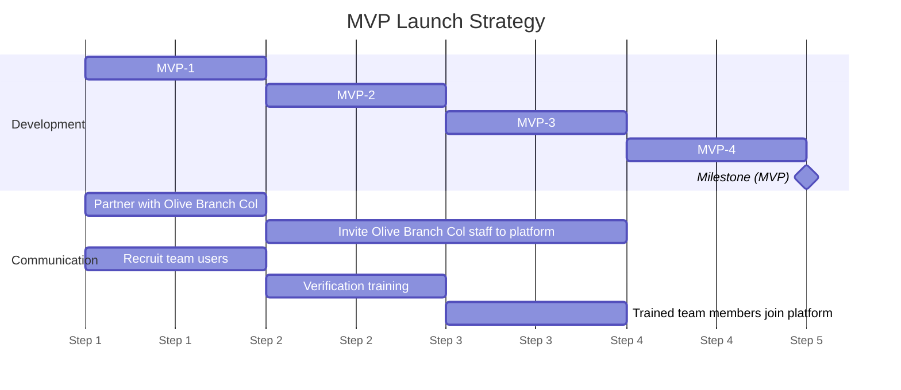

- `MVP-1` features:
  - Public listing that can be viewed by anyone
  - Ability to create partner invites, by admins.
  - _Partner-verified_ end users[^3] (the only type of end users at this point), can post ads[^1] to the public listing
- `MVP-2` features:
  - Create a public _end user signup_, leading to the creation of `unverified` users
  - Unverified users can now post ads[^1] to the public listing, which shows next to their verifications
  - By the end of this step, we have `partner verified` and `unverified` ads in a public listing, mostly made of "GoFundMe campaign links".
- `MVP-3`:
  -  Ability to create _pals or team user[^2] invites_, by admins.
  -  Pals have real-time access to verification requests.
  -  Pals have real-time access to newly posted ads and requests, and have the ability to tag/approve them.
- `MVP-4` features:
  - End users can now request ID/Gaza verification.
  - Verification requests are logged with the IP of the requester. Pals see these requests popping up in real time.
  - Depending on the type of verification, we might transition to a secure chat to exchange and vet personal information, or request an anonymous video call (unsure how at this point).
  - Pals must be able to add verifications to end user profile data, including failed verifications.
- `MVP Milestone`:
  - A public listing of crowdfunding campaigns including ones made by users with different verifications.

[^3]: End users, or simply the users of our platform, are the ones making ads/requests and responding to requests, in an effort to share solidarity with others for Gaza.
[^1]: Ads are public listing items that do not accept responses and have no visibility filters (they can be seen by everyone, even those who are guests and not end users.
[^2]: Pals (previously team users) are, unlike end users, are users who are recruited by the platform to conduct human verifications and other team tasks. Their responsibilities may also change
over time, for example, they may tag requests initially, then transition to more of an approver after the tags become a part of the request form, as end users become more aware
and experienced, and our interface become more intuitive.
    
